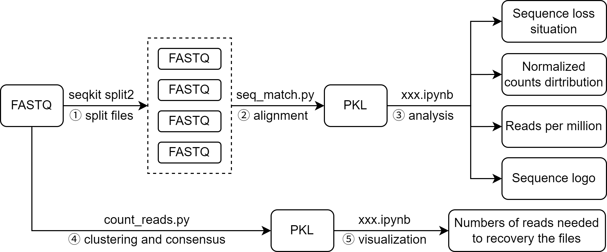

# Live-Cell-Data-Storage

## Pipeline Overview



## Step-by-step Description

### ① FASTQ preprocessing
- Tool: `seqkit split2`
- Purpose: Split large FASTQ files into smaller chunks for parallel processing

### ② Sequence alignment
- Script: `seq_match.py`
- Input: split FASTQ files + reference library
- Output: `.pkl` file containing mapping results

### ③ Analysis
- Notebook: `xxx.ipynb`
- Includes:
  - Sequence loss analysis
  - Normalized count distribution
  - Reads per million
  - Sequence logo

### ④ Clustering and consensus
- Script: `count_reads.py`
- Purpose:
  - Cluster similar reads
  - Generate consensus sequences
- Output: `.pkl`

### ⑤ Visualization
- Notebook: `xxx.ipynb`
- Includes:
  - Reads required for file recovery

## Quick Start

### 1. Split FASTQ

If the FASTQ file obtained from sequencing is too large, running our multiprocessing alignment pipeline may fail due to memory limitations. Therefore, the large FASTQ file should be split into smaller chunks for processing, and the results can be merged afterward. For example, the following command splits the FASTQ file into chunks of 5,000,000 reads each, and outputs the split files to the `split_fastq/` directory:

```text
seqkit split2 input.fastq -s 5000000 -O split_fastq/
```

### 2. Run mapping
```text
python seq_match.py --input split_fastq/ --ref reference.csv --output result.pkl
```

### 3. Run analysis
```text
jupyter notebook xxx.ipynb
```

## Input and Output

### Input
- FASTQ files
- Reference library (CSV/XLSX)

### Output
- PKL files (intermediate results)
- Figures:
  - Sequence logo
  - Error distribution
  - Coverage plots